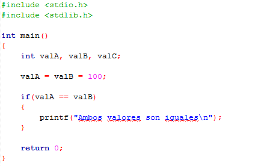
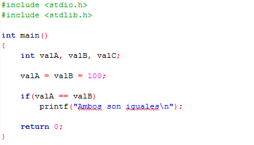
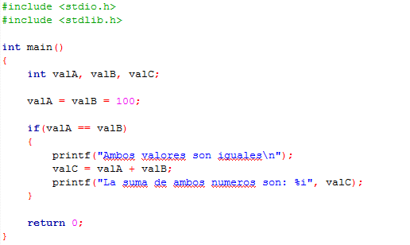
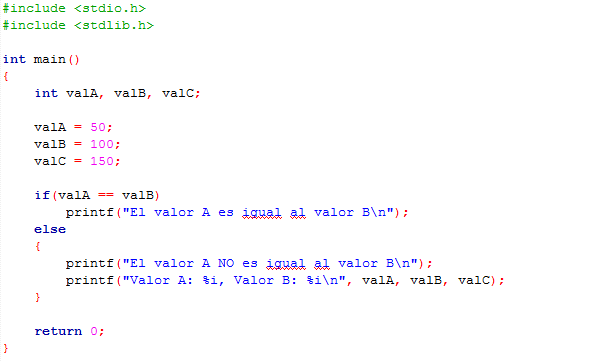

# Clase 8 _Condicional if e if - else_

Las condicionales son instrucciones que evalúan resultados booleanos (verdadero
o falso), generalmente usados para alterar el flujo de un programa.

Una sentencia condicional es una instrucción o grupo de instrucciones que se
pueden ejecutar o no en función del valor de una condición.

**Condicional if**

La sentencia solo se ejecuta si se cumple la condición. En caso contrario el
programa sigue su curso sin ejecutar la sentencia.

En este ejemplo declaramos tres variables enteras y asignamos a dos variables (A
y B) el valor de 100. Usando la condicional, evaluamos si ambos valores son
iguales, si esa condición se cumple nos imprime un mensaje en pantalla.

Hay que tener en cuenta que si la sentencia a ser ejecuta es simplemente una
línea, podemos obviar las llaves y sigue siendo completamente valido.

En cambio, si la sentencia a ser ejecutada son varias líneas es obligatorio
poner las llaves para que pueda ejecutarse el código. Esto es visto en el
ejemplo, donde nos imprime un mensaje y posteriormente guardamos la suma de las
variables A y B dentro de la variable C, para luego imprimirla en pantalla.

**Condicional if - else**

Se añade una instrucción else que ejecuta una segunda sentencia si la condición
no se cumple. En cualquier caso, el programa continuará a partir de la
sentencia2.

En nuestro ejemplo declaramos tres variables y le asignamos distintos valores.
Si el valor de la variable A es igual a la variable B, entonces nos imprime un
mensaje en pantalla. Si resulta ser falso, es decir, la variable A es distinto a
la variable B, entonces se nos ejecutara la sentencia else que nos imprime un
mensaje y nos muestra los valores de las variables.

**Condicional else if**

Nosotros podemos tener tantas condiciones como queremos. Usando else if podemos
poner una segunda, tercera, cuarta o n condiciones como queremos. Si una de
ellas se cumple, se ejecuta la sentencia correspondiente y salta hasta el final
de la estructura para continuar con el programa.

Seguimos con el ejemplo de tres variables con valores distintos. Tenemos una
primera condición (if) que evalúa si el valor de la variable A es igual al valor
de la variable B. Después, en la segunda condición (else if), se evalúa si el
valor de la variable B es igual al valor de la variable C. Y si ninguna de esas
condiciones se cumple, es decir, si A no es igual a B o B no es igual a C, nos
ejecuta la última sentencia (else) que nos imprime un mensaje en pantalla y el
valor de las tres variables.

**NOTA:**

No debemos confundir = con el ==.

Un solo igual (=) es asignación, asigna un valor a algo (ejemplo, valA = 50). En
cambio, dos iguales (==) son para comparar, evalúan si un valor es igual otro
valor (ejemplo, valA == valB).

**RETO**

Haremos un programa que adivine número de la computadora

- Define una variable cuyo valor es 5
- En otra variable ingresar un número con las instrucciones, entre el 1 y el 10
- Si el número ingresado es igual a la variable definida (5), imprimir
  "Adivinaste". Si no, imprimir "Ese no es, perdiste!".
