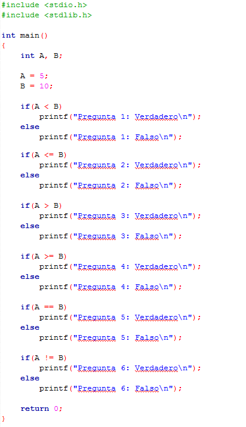
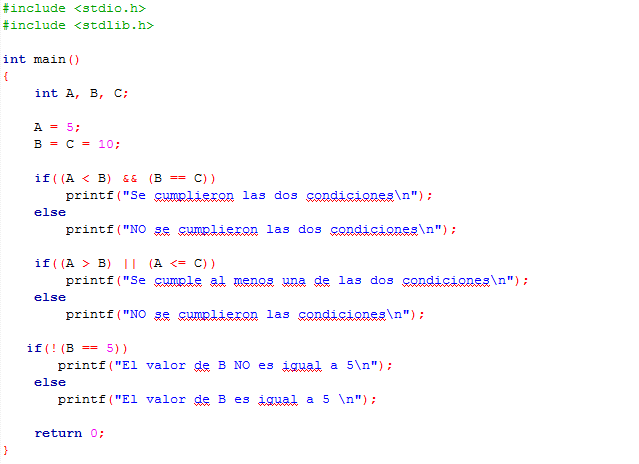

# Clase 9 *Operadores relacionales y lógicos*

Se llaman operadores relacionales o de comparación a aquellos que permiten comparar dos valores evaluando si se relacionan cumpliendo el ser menor uno que otro, mayor uno que otro, igual uno que otro, etc. Los operadores lógicos permiten además introducir nexos entre condiciones como “y se cumple también que” u, “o se cumple que”.

**Operadores Relacionales**

- Menor que (<)
- Menor o igual que (<=)
- Mayor que (>)
- Mayor o igual que (>=)
- Igual que (==)
- No igual que (!=)

Tenemos el siguiente ejemplo:

Declaramos dos variables, A y B, y le asignamos los valores de 5 y 10, respectivamente. Con este ejemplo podemos ver cada uno de los operadores relacionales:

1. Evaluamos si el valor de A es menor al valor de B. Dado que el valor de A es 5 y el valor de B es 10, la condición es verdadera. ***Si por ejemplo, el valor de A sea igual al valor de B, entonces nos saldría falso porque la condición evalúa que el número sea estrictamente menor para ser verdadera.***
2. Evaluamos si el valor de A es menor o igual al valor de B. Dado que el valor de A es 5 y el valor de B es 10, la condición es verdadera. ***Si por ejemplo, el valor de A sea igual al valor de B, entonces nos seguiría dando verdadero. Para que nos dé falso, el valor de A debe ser únicamente mayor al valor de B.***
3. Evaluamos si el valor de A es mayor al valor de B. Dado que el valor de A es 5 y el valor de B es 10, la condición es falsa.
4. Evaluamos si el valor de A es mayor o igual al valor de B. Dado que el valor de A es 5 y el valor de B es 10, la condición es falsa.
5. Evaluamos si el valor de A es igual al valor de B. Dado que el valor de A es 5 y el valor de B es 10, la condición es falsa.
6. Evaluamos si el valor de A es no es igual al valor de B. Dado que el valor de A es 5 y el valor de B es 10, la condición es verdadera.

**Operadores Lógicos**

- AND (&&) : Y
- OR (||) : O
- NOT (!) : No

Teniendo en cuenta el siguiente ejemplo:

Hacemos uso de los operadores lógicos para evaluar ciertas condiciones.

1. ¿A es menor a B Y B es igual a C? Verdadero, porque ambas condiciones se cumplen. Si al menos una de las condiciones no se cumple, entonces toda la sentencia es falsa.
2. ¿A es menor a B O A es menor o igual a C? Verdadero. Mientras una de las condiciones se cumpla nos seguirá dando verdadero, la única manera en que nos dé falso es que ambas condiciones NO se cumplan.
3. ¿B NO es igual a 5? Verdadero. Recordemos que el valor de B es 10, por obviedad su valor NO es 5.

**PRIMER RETO**

- Imprime una instrucción
- Ingresa el numero en una variable
- Repite para una segunda variable
- Si el primer número es menor que el segundo, imprime el mensaje "El número menor es: " y el primer numero
- Si no, imprime el segundo numero

**SEGUNDO RETO**

- Hacer un programa que reciba la calificación de un alumno
- Si el alumno saco menos de 60, imprime que el alumno esta reprobado
- Si el alumno saco más de 60, imprime que el alumno está aprobado

Extra: Si el alumno saco más de 90, imprime que está aprobado y una carita feliz
