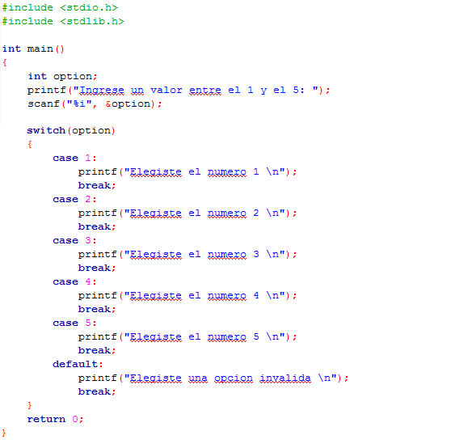

# Clase 10 _Switch_

Switch es una estructura de control para agilizar el flujo del programa en
opciones múltiples.

Se tiene una condición que se puede cumplir dependiendo de diferentes casos,
cada caso nos lleva a un bloque de cumplimiento de la condición y ese bloque nos
lleva a continuar el programa.

Tenemos el siguiente ejemplo:

Declaramos una variable entera 'option' y esperamos que el usuario ingrese un
número cualquiera entre el 1 y el 5. Si el número se encuentra dentro del rango,
nos imprimirá un mensaje que nos diga el número elegido. Con default se ejecuta
en caso de que el número ingresado no cumpla con ninguna de las condiciones, es
decir, no se encuentra dentro del rango.

**NOTA**

Podemos ver que no usamos operadores relaciones o lógicos dentro del switch, eso
es porque cada instancia case se encarga de realizar la comparación entre el
valor del caso y la expresión. Por ejemplo, en la primera instancia (case 1)
comparamos si el número ingresado en option es 1, si se cumple la declaración
dentro de la instancia se ejecuta lo de adentro hasta que es interrumpida por el
break. Si no se cumple, pasa a la siguiente instancia.

La instancia default es opcional, pero cuando se declarada es ejecutada si el
valor de la expresión no coincide con cualquiera de las otras instancias case.

Las sentencias break hacen que, una vez verificado que se cumple una opción
dentro del switch, se salga del mismo y se continúe la ejecución en la siguiente
instrucción después del switch. El uso de break es opcional, pero es habitual
incluir un break después de cada evaluación. En caso de no hacerlo, se
ejecutarán todas las instrucciones dentro de cualquier case (incluso aunque no
se verifique) después del que ha verificado la condición hasta encontrar una
sentencia break; o terminar la ejecución del switch. Esto puede generar
resultados contradictorios o no esperados, de ahí que en general siempre se
incluyan sentencias break.

**RETO**

Vamos a hacer un pequeño juego de texto:

- Imprimir una pequeña introducción, con tres opciones a elegir, numerada del 1
  al 3
- Cada una de ellas te debe de imprimir un resultado distinto en la historia
