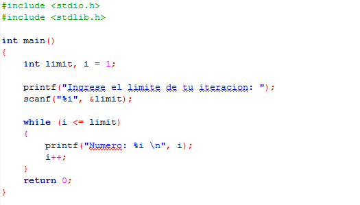

# Clase 11 *¿Qué es un iterador? - Ciclo While*

Un loop es una estructura iterativa que permite repetir un bloque de instrucciones. Esta repetición es controlada por una condición booleana.

Un iterador es utilizado por un algoritmo para recorrer los elementos almacenados en un contenedor. Dado que los distintos algoritmos necesitan recorrer los contenedores de diversas maneras para realizar diversas operaciones, y los contenedores deben ser accedidos de formas distintas, existen diferentes tipos de iteradores.

**While**

Es una estructura de control en la que la repetición se realizará tantas veces como se indique mientras se cumpla una condición.

Teniendo en cuenta el siguiente ejemplo:

Nosotros tenemos dos variables: limit que permite al usuario ingresar el límite de la iteración e i que inicializa en uno. Con while repetiremos e imprimiremos los números según nuestro límite.

Por ejemplo, si nuestro límite es 5 entonces compara si la variable i es menor o igual a limit. Si la condición se cumple imprime el número, siendo la variable i inicialmente 1, se cumple y nos imprime en pantalla, y luego el programa vuelve dentro del while y se repetirá hasta que la condición ya no se cumpla.

**RETO**

- Hacer un programa que imprima el símbolo de # cinco veces.

Tip: Puedes usar operadores de incremento y decremento.