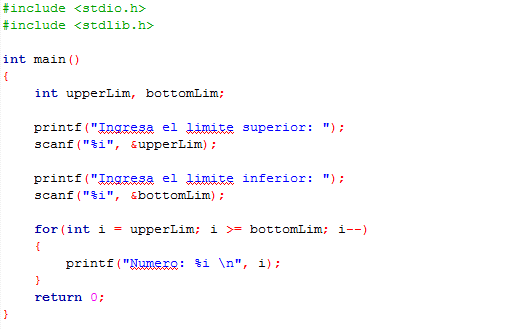

# Clase 12 _Ciclo For_

El ciclo for es una estructura de control que nos permite repetir un bloque de
comandos un número de veces específico.

Este ciclo se compone de tres partes:

1. Inicialización: Se inicializa una variable (generalmente "i") al asignarle el
   valor 0.
2. Condición: Se indica la condición necesaria para que termine el ciclo.
3. Incremento: También puede ser decremento; este va a indicar los pasos en los
   que se moverá el ciclo, este número siempre debe ser entero, para ir de uno
   en uno se utiliza el i++.

Teniendo en cuenta el siguiente ejemplo:

Nosotros declaramos dos variables que permiten al usuario ingresar el valor de
los limites superior e inferior. Usamos for para imprimir los números en orden
descendentes, en la primera parte inicializamos una variable 'i' con el valor
del límite superior, en la segunda parte evaluamos si la variable i es mayor o
igual al límite inferior, y en la tercera parte decrementamos la variable i.

**RETO**

- Usando for, imprime la secuencia Fibonacci hasta la novena vuelta
