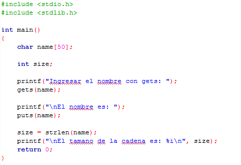

# Clase 18 _Cadena de caracteres (string)_

En C no existe un tipo predefinido para manipular cadenas de caracteres
(string). Sin embargo, el estándar de C define algunas funciones de biblioteca
para tratamiento de cadenas. Una cadena en C es un array de caracteres de una
dimensión (vector de caracteres) con la particularidad que tienen una marca en
el fin del mismo (el caracter '\0'), además el lenguaje nos permite escribirlas
como texto dentro de comillas dobles si son simples no.

Por ejemplo la cadena "Hola" en C se considera un array formado por los
elementos 'H', 'o', 'l', 'a'.

Para comprender mejor como funciona una cadena de caracteres en C debemos saber
algunos conceptos que usaremos como:

- gets: La función que lee una cadena de texto desde el teclado.
- puts: La función que muestra una cadena de texto en pantalla y avanza de
  línea.
- strlen: Se encarga de devolver la longitud de una cadena de texto

En nuestro siguiente ejemplo:

Declaramos un arreglo 'name' de tipo carácter con un tamaño de 50 y una variable
'size' de tipo entero. Imprimimos en pantalla un mensaje para que el usuario
sepa cuando ingresar la cadena de nombre con gets, después imprimimos la cadena
ingresada con puts y guardamos el tamaño de la cadena en size para
posteriormente imprimirla.

**RETO**

- Haz un programa que reciba una cadena de caracteres e imprima de regreso la
  misma cadena de forma invertida.
