# Clase 19 *Recapitulación: Control de Flujo*

En esta lectura vamos a recapitular los conceptos de control de flujo que aprendimos en el curso.

**If**

Empezamos con condicionales o sentencias condicionales. Estas son instrucciones que evalúan resultados booleanos, esto quiere decir que evalúan una condición que va a tener como resultado algo verdadero o falso. Dependiendo del resultados nosotros podemos usar estas condiciones para controlar el flujo de nuestro programa y los resultados que nosotros queremos que tenga.

La estructura para escribir una condición es la siguiente:

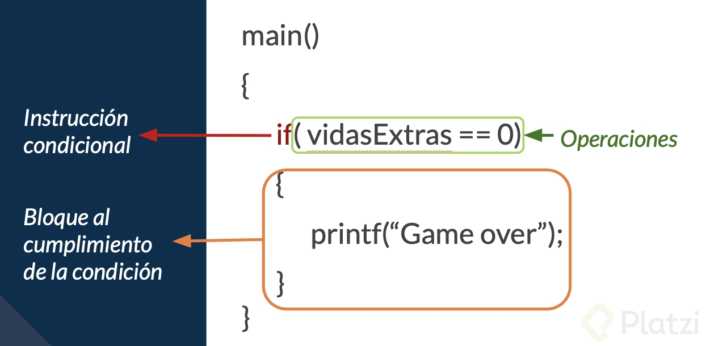

Dentro del paréntesis después de la instrucción if, escribimos la operación que va a ser la condición a revisar. Si esta se cumple entra al bloque de cumplimiento de la condición y podemos ejecutar instrucciones. Si no se cumple la condición, el programa continua y no entra al bloque de cumplimiento de la condición.

**Operadores relacionales y lógicos**

Al utilizar condiciones, para ayudarnos a evaluar las operaciones nosotros podemos utilizar operadores relacionales y operadores lógicos.

Los operadores relacionales son:

- (<) Menor que
- (- <)= Menor o igual que
- (>) Mayor que
- (>)= Mayor o igual que
- (==) Igual (Utilizado como comparación y NO como asignación)
- (!=) Diferente/No igual que

Los operadores lógicos son:

- && Y/And

Teniendo en cuenta más de una condición, el resultado será verdadero si ambas condiciones son verdaderas.
- || O/Or

Teniendo en cuenta más de una condición, el resultado será verdadero si alguna o ambas condiciones son verdaderas, solo una necesita cumplirse.

- ! No/Not

El resultado es inverso al operando.

**Switch**

Otra estructura de control de flujo que podemos utilizar es el switch. Esta es una estructura de control que nos permite agilizar el flujo es opciones múltiples.

Su estructura es la siguiente:

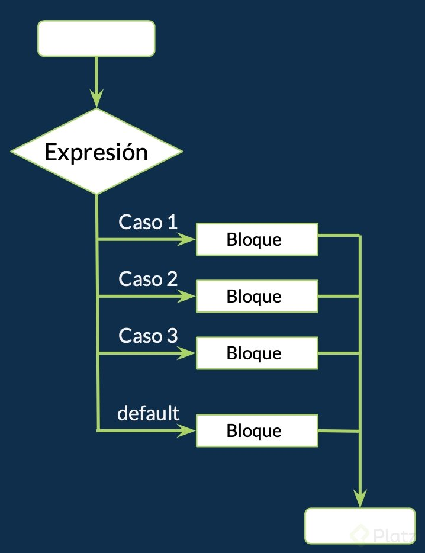

En esta estructura se evalúa una expresión y se evalúa cada caso potencial de resultado con respecto a esa instrucción, o sea, si en la expresión se evalúa una variable de tipo int, en los casos se evalúan valores de tipo int. Si en la expresión se evalúan variables de tipo char, en los casos se evalúan valores de tipo char, por ejemplo:

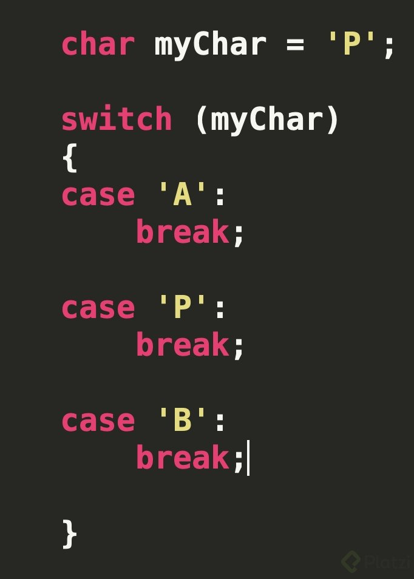

**Loops**

Un loop es una estructura iterativa que permite repetir un bloque de instrucciones. Esta repetición es controlada por una condición booleana.

**Loops - While**

El iterador While es una estructura de control donde el bloque de instrucciones se repetirá siempre que la condición se cumpla.

La sintaxis es la siguiente:

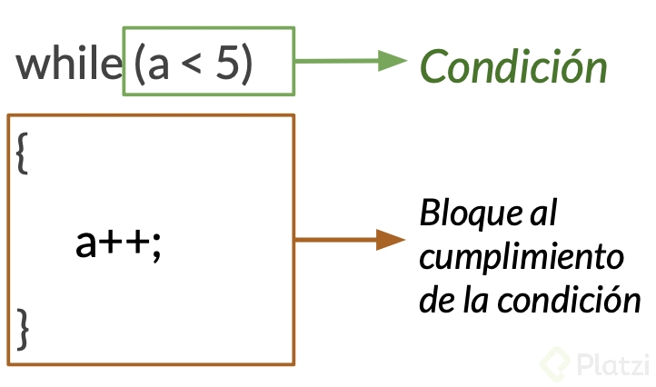

Después de la instrucción while dentro de los paréntesis tenemos la condición, siempre que esta se cumpla el bloque al cumplimiento de la condición se repetirá. Dentro de los corchetes se encuentra el bloque al cumplimiento de la condición, este es una serie de instrucciones que queramos que se repita. Al dejar de cumplirse la condición o no cumplirse en lo absoluto, el flujo del programa seguirá después de los corchetes.

**Loops - For**

El iterador for es una estructura de control que nos permite repetir un bloque de instrucciones un número de veces especifico.

La sintaxis de un for es la siguiente:

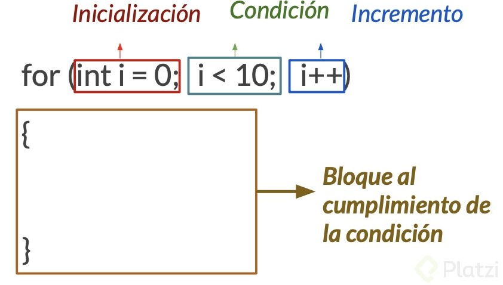

Después de la instrucción for, dentro de los paréntesis la estructura se divide en tres partes: inicialización, condición e incremento.

En la primera sección inicializamos una variable que utilizaremos para medir la cantidad de veces que se repetirá el bloque. En la condición definimos el número de veces que se repetirá, esta es una condición y siempre que se cumpla seguirá repitiéndose el bloque, entonces utilizamos una variable de tipo int y revisamos en la condición siempre que ese número sea menor o mayor que alguna variable o número que hayamos definido con anticipación. Finalmente en el incremento, que también puede ser decremento, sucede después del bloque al cumplimiento de la condición y modificamos la variable para eventualmente incumplir la condición y salir del iterador.

**Loops - Do While**

Este iterador es similar al while, con la diferencia de que la condición se prueba al final de la misma, se evalúa al final.

Su sintaxis es la siguiente:

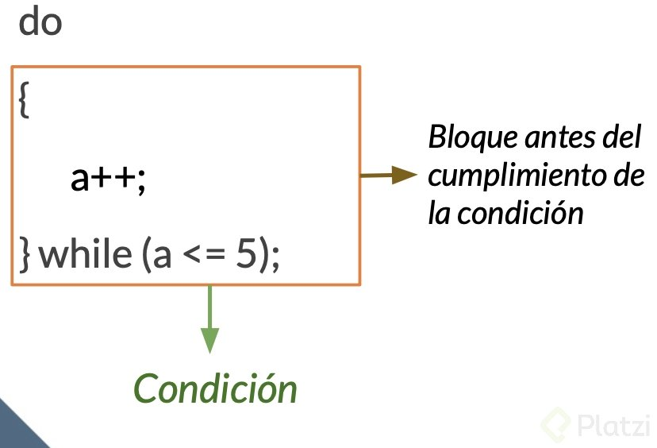

De manera similar el while, tenemos una condición y siempre que esta se cumpla un bloque se repetirá. La diferencia se encuentra con la instrucción do, en la que se cumplirá ese bloque antes de checar la condición y se repetirá.

**Arreglos**

Un arreglo es una serie de elementos del mismo tipo de dato y almacenados de manera consecutiva. Estos pueden tener de una a varias dimensiones, pero durante el curso vimos arreglos unidimensionales y bidimensionales, una y dos dimensiones respectivamente.

De la misma manera que una variable nosotros podemos declarar e inicializar un arreglo unidimensional, también llamados vectores, la sintaxis es la siguiente:

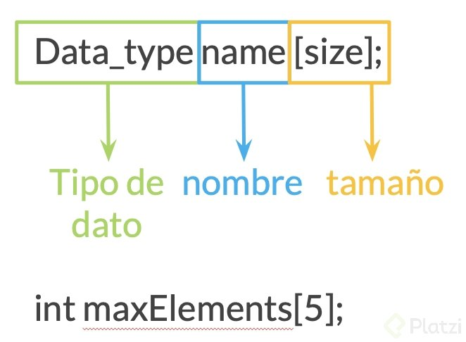

Para declarar un arreglo definimos al igual que una variable su tipo de dato y su nombre, seguido de esto dentro de corchetes cuadrados ingresamos el tamaño de nuestro arreglo. Con esto indicamos que va a ser un arreglo y su tamaño.

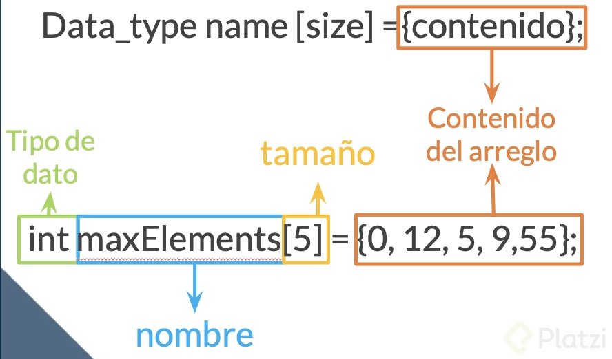

La estructura es similar a declarar una variable con la diferencia de que agregamos valores dentro del contenido del arreglo. Estos valores van dentro de corchetes separados por comas.

Los arreglos bidimensionales también llamados matrices son arreglos de dos dimensiones. Estos tienen dos índices, el primero indica el número de fila y el segundo el número de columna en que se encuentra el elemento.

La sintaxis para declarar e inicializar un arreglo bidimensional es la siguiente:

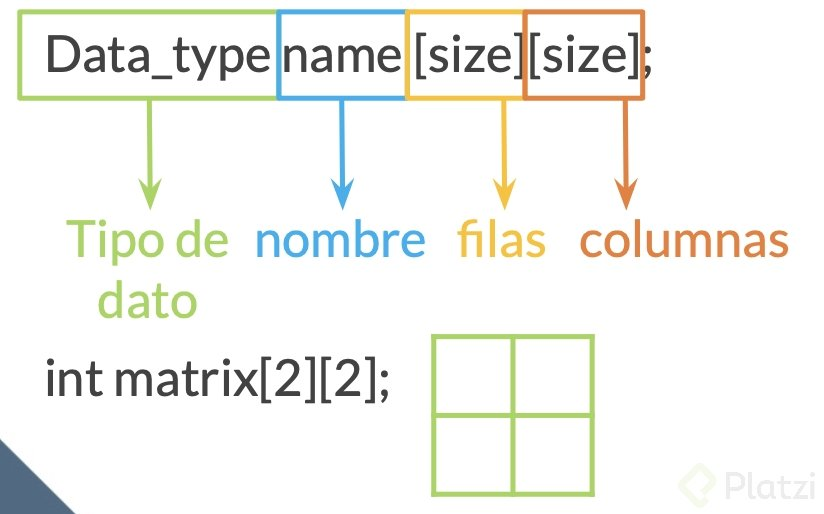

Para declarar dentro de la misma manera que unidimensional definimos el tipo de dato y nombre. Adicionalmente agregamos doble corchetes cuadrados, el primero para indicar el número de filas y el segundo para el número de columnas.

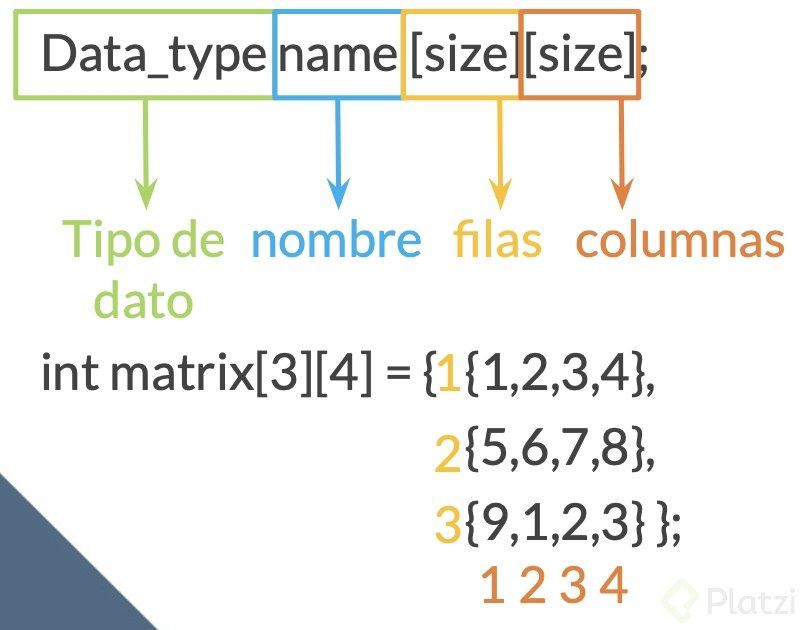

Para inicializar el arreglo, agregamos de igual manera entre corchetes los valores, separando cada fila en corchetes independientes, separados por comas. Y dentro de estos corchetes agregamos los valores también separados por comas.

**Arreglos e iteradores**

Una par de estructuras comúnmente utilizadas conjuntamente son los arreglos e iteradores. ¿Por qué utilizamos estas estructuras de manera conjunta?:

- Para manipular todos los elementos de un arreglo podemos utilizar una estructura repetitiva. La más usual es el ciclo for.
- Cuando desea imprimir el contenido del arreglo.
- Cuando se suman todos los elementos.
- También cuando se va a inicializar.

Para poder utilizar el iterador for junto con un arreglo bidimensional es necesario entender el concepto de un for anidado. Esto es un for dentro de un for, la sintaxis es la siguiente:

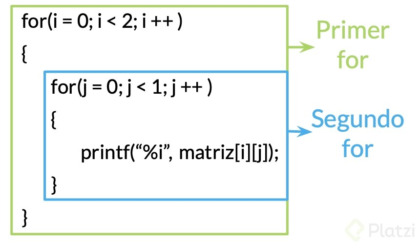

En esta estructura al inicial el for, se recorre vuelta por vuelta ambos fors, iniciando por la primera vuelta del primer for y continuando con todas las vueltas del segundo for. Siguiendo con la siguiente vuelta del primer for y continuando con todas las vueltas del segundo for, y así sucesivamente.

Esto es muy útil para recorrer arreglos bidimensionales.

Espero que estas recapitulaciones te sean útiles para repasar conceptos y revisar estructuras, ¡nos vemos en la siguiente clase!