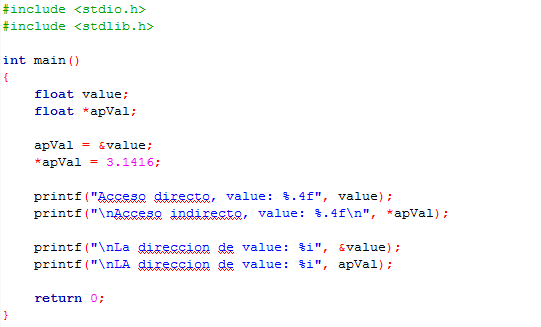

# Clase 24 _Apuntadores_

Un puntero es una variable que contiene la dirección de memoria de una variable
dinámica donde se podrá almacenar un valor. Cuando se declara un puntero, de
igual manera que con cualquier variable, su contenido es indefinido hasta que se
le asigne un valor. Mientras esto no ocurra no se puede decir que exista una
variable referenciada, en esta situación se dice que el puntero no está apuntado
a una dirección válida. Un apuntador puede inicializarse en NULL que corresponde
a una dirección 0 o nula. NULL es una constante simbólica definida en el archivo
de cabeceras stddef.h el cual a su vez es incluido en el archivo de
cabeceras stdio.h. Al inicializar un puntero en NULL se garantiza que el puntero
no apunte a una dirección inválida pero con esto tampoco se define una variable
referenciada.

**Operadores de punteros**

Básicamente existen dos operadores para manipular los punteros, estos son:

- El operador de dirección (&) regresa la dirección de una variable.
- El operador de indirección (\*) toma la dirección de una variable y regresa el
  dato que contiene esa dirección.

Teniendo en cuenta el siguiente ejemplo:

Contamos con dos variables: una variable flotante llamada 'value' y un apuntador
llamado 'apVal'. Podemos ver que para declarar un apuntador es necesario el tipo
de dato y poner un asterisco (\*) antes del nombre que tendrá nuestro apuntador.

Con el ampersand (&) hacemos que nuestro puntero apVal apunte a la variable
value. Y con el asterisco (\*) hacemos que ahora la variable value tenga el
valor de 3.1416.

Nosotros podemos imprimir tanto directa como indirectamente el valor de nuestra
variable: directamente seria la forma normal en donde ponemos el nombre de la
variable y la forma indirecta sería mediante el apuntador escribiendo
\*\_nombreApuntador. También podemos imprimir la dirección en donde se encuentra
nuestra variable al escribir &\_nombreVariable o simplemente el nombre del
puntero.
