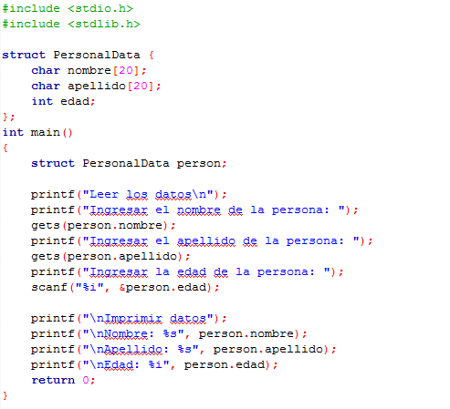
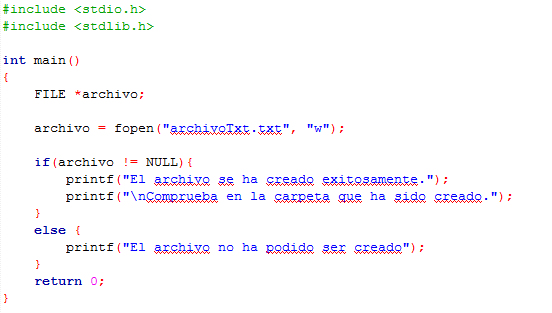

# Clase 25 _Struct y manejo de archivos_

**Estructura**

Las estructuras, o struct, son colecciones de variables relacionadas bajo un
nombre. Las estructuras pueden contener variables de muchos tipos diferentes de
datos. Los datos que contiene una estructura pueden ser de tipo simple
(caracteres, números enteros o de coma flotante etc.) o a su vez de tipo
compuesto (vectores, estructuras, listas, etc.). Es diferente a los arreglos que
contienen únicamente elementos de un mismo tipo de datos.

Su utilización más habitual es para la programación de bases de datos, ya que
están especialmente indicadas para el trabajo con registros o fichas.

A cada uno de los datos o elementos almacenados dentro de una estructura se les
denomina miembros de esa estructura y éstos pertenecerán a un tipo de dato
determinado.

Observemos nuestro siguiente ejemplo:

Declaramos una estructura poniendo struct \_nombreEstructura y en su interior
los miembros. En nuestro ejemplo tenemos una estructura llamada PersonalData con
tres miembros: dos arreglos de caracteres con tamaño 20 llamados nombre y
apellido, y un entero llamado edad.

En la función principal main, definimos una nueva estructura llamada person al
cual asignaremos valores siguiendo. Para acceder a los datos colocamos el nombre
de la variable de tipo estructura seguido de un punto y seguido del nombre del
miembro de la estructura: person.nombre, person.apellido y person.edad. De la
misma forma podemos imprimir los valores de esos mismos miembros.

**Manejo de Datos**

Así como hemos revisado la salida y entrada por pantalla y teclado
respectivamente, veremos ahora la entrada y/o salida de datos utilizando
ficheros, lo cual será imprescindible para un gran número de aplicaciones que
deseemos desarrollar.

**Ficheros**

Los archivos o ficheros brindan una forma de guardar permanentemente los datos y
resultados de nuestros programas. Es importante indicar que los ficheros no son
únicamente los archivos que guardamos en el disco duro. En C todos los
dispositivos del ordenador se tratan como ficheros: la impresora, el teclado, la
pantalla, etc.

El estándar de C contiene varias funciones para la edición de ficheros, éstas
están definidas en la cabecera stdio.h y por lo general empiezan con la letra f,
haciendo referencia a file. Adicionalmente se agrega un tipo FILE, el cual se
usará como apuntador a la información del fichero. La secuencia que usaremos
para realizar operaciones será la siguiente:

- Crear un apuntador del tipo FILE \*
- Abrir el archivo utilizando la función fopen y asignándole el resultado de la
  llamada a nuestro apuntador.
- Hacer las diversas operaciones (lectura, escritura, etc).
- Cerrar el archivo utilizando la función fclose.

**El puntero**

Todas las funciones de entrada/salida estándar usan el puntero FILE \* para
conseguir información sobre el fichero abierto. Este puntero no apunta al
archivo sino a una estructura que contiene información sobre él. Esta estructura
incluye entre otras cosas información sobre el nombre del archivo, la dirección
de la zona de memoria donde se almacena el fichero, tamaño del buffer.

**FOPEN**

Es el apuntador del fichero para lectura. Usado para abrir el fichero.

Tenemos el siguiente ejemplo:

En el que declaramos una variable 'archivo' y vemos que al usar fopen se envia
dos parametros: el primero es el nombre del archivo con la extensión que
deseamos y el segundo es el modo.

**_NOTA: El nombre de fichero se puede indicar directamente (como en el ejemplo)
o usando una variable y se puede abrir de diversas formas. Esto se especifica
con el parámetro modo._**

Modos

- r: Abre un fichero existente para lectura.
- w: Crea un fichero nuevo (o borra su contenido si existe) y lo abre para
  escritura.
- a: Abre un fichero (si no existe lo crea) para escritura. El puntero se sitúa
  al final del archivo, de forma que se puedan añadir datos si borrar los
  existentes.

Se pueden añadir una serie de modificadores siguiendo a los modos anteriores:

- b: Abre el fichero en modo binario.
- t: Abre el fichero en modo texto.
- +: Abre el fichero para lectura y escritura.

Ejemplos de combinaciones:

- rb+: Abre el fichero en modo binario para lectura y escritura.
- w+: Crea (o lo borra si existe) un fichero para lectura y escritura.
- rt: Abre un archivo existente en modo texto para lectura.
